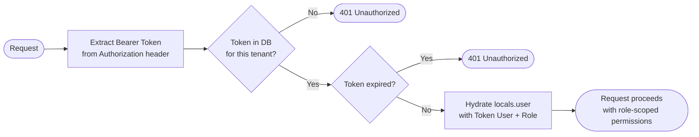

# API & Invitation Tokens

SveltyCMS uses two distinct token mechanisms for programmatic access:

1. **Invitation Tokens** — Time-limited, single-use tokens for onboarding new users via email.
2. **Website / API Tokens** — Long-lived tokens for headless frontends and CI/CD pipelines.

> [!NOTE]
> Invitation tokens are tied to an **email** and a **role**. They are not the same as session cookies — they provide a one-time registration link, not ongoing API access. For ongoing API access, use API tokens configured in **Settings > Access Management**.

---

## 👥 Choose Your Path

- 📋 **[List Tokens](#1-list-tokens)** — Paginated, searchable token registry.
- ✉️ **[Create Invitation Token](#2-create-invitation-token)** — Send a timed invite link to a new team member.
- 🗂️ **[Manage a Single Token](#3-single-token-management)** — View or delete a specific token by ID.
- 📦 **[Batch Operations](#4-batch-token-operations)** — Bulk-delete stale tokens.
- 🔒 **[Auth Middleware](#5-how-tokens-are-validated)** — How `handleTokenResolution` works at request time.

---

## 🚀 Quick Reference

| Method | Endpoint                  | Permission     | Description                                  |
| :----- | :------------------------ | :------------- | :------------------------------------------- |
| GET    | `/api/token`              | `manage_users` | List all invitation tokens (paginated)       |
| POST   | `/api/token/create-token` | `manage_users` | Create an invitation token and send an email |
| GET    | `/api/token/[tokenID]`    | `manage_users` | Retrieve a single token by its ID            |
| DELETE | `/api/token/[tokenID]`    | `manage_users` | Delete a specific token                      |
| POST   | `/api/token/batch`        | `manage_users` | Bulk-delete multiple tokens                  |

---

## 1. List Tokens

**Endpoint**: `GET /api/token`

Returns a paginated, searchable list of invitation tokens for the current tenant.

### Query Parameters

| Parameter | Type        | Default     | Description                                            |
| :-------- | :---------- | :---------- | :----------------------------------------------------- |
| `page`    | `number`    | `1`         | Current page.                                          |
| `limit`   | `number`    | `10`        | Results per page.                                      |
| `sort`    | `string`    | `createdAt` | Field to sort by (e.g., `expires`, `email`).           |
| `order`   | `asc\|desc` | `desc`      | Sort direction.                                        |
| `search`  | `string`    | `""`        | Case-insensitive match against `email` or token value. |

### Response Shape

```json
{
  "success": true,
  "data": [
    {
      "_id": "token_abc123",
      "email": "newuser@example.com",
      "type": "invite",
      "expires": "2026-04-03T09:00:00.000Z",
      "tenantId": "tenant_xyz"
    }
  ],
  "pagination": {
    "page": 1,
    "limit": 10,
    "totalItems": 4,
    "totalPages": 1
  }
}
```

---

## 2. Create Invitation Token

**Endpoint**: `POST /api/token/create-token`

Creates an invitation token for a new user and sends them a registration link via email.

### Payload

```json
{
  "email": "neweditor@example.com",
  "role": "editor",
  "expiresIn": "2 days"
}
```

| Field       | Type     | Required | Description                                                 |
| :---------- | :------- | :------- | :---------------------------------------------------------- |
| `email`     | `string` | ✅       | The invitee's email address.                                |
| `role`      | `string` | ✅       | Role ID to grant on registration (e.g., `editor`, `admin`). |
| `expiresIn` | `string` | ✅       | Token validity window (see table below).                    |

### Valid `expiresIn` Values

| Value       | Expiry   |
| :---------- | :------- |
| `"2 hrs"`   | 2 hours  |
| `"12 hrs"`  | 12 hours |
| `"2 days"`  | 2 days   |
| `"1 week"`  | 7 days   |
| `"2 weeks"` | 14 days  |
| `"1 month"` | 30 days  |

> [!IMPORTANT]
> Only one invitation token may exist per email address within a tenant. Attempting to create a second one returns `409 TOKEN_EXISTS`. Delete the existing token first, then re-invite.

### Pre-flight Checks

Before creating the token, the endpoint verifies:

1. No existing **user** account has this email in the current tenant (`409 USER_EXISTS` if so).
2. No existing **token** already targets this email (`409 TOKEN_EXISTS` if so).
3. The `role` value corresponds to a valid system role.

### Response

**Success (SMTP configured)**:

```json
{
  "success": true,
  "message": "Token created and email sent successfully.",
  "token": { "value": "<token>", "expires": "2026-04-03T..." },
  "email_sent": true
}
```

**Success (SMTP not configured — token preserved for manual delivery)**:

```json
{
  "success": true,
  "message": "Token created; email not sent - SMTP not configured.",
  "token": { "value": "<token>", "expires": "2026-04-03T..." },
  "email_sent": false,
  "smtp_not_configured": true
}
```

> [!TIP]
> Even when email delivery fails or SMTP is not configured, the token is **preserved** in the database. Admins can retrieve the `token.value` from this response and deliver the link manually: `<origin>/login?invite_token=<token>`.

---

## 3. Single Token Management

### Get Token

**Endpoint**: `GET /api/token/[tokenID]`

Fetches the details of a specific token by its database ID. Useful for checking expiry status before resending an invite.

### Delete Token

**Endpoint**: `DELETE /api/token/[tokenID]`

Immediately invalidates the token. The invitation link becomes unusable. The user record is not affected (if they already registered before deletion).

---

## 4. Batch Token Operations

**Endpoint**: `POST /api/token/batch`

Bulk-delete multiple expired or redundant tokens.

**Payload**:

```json
{
  "tokenIds": ["token_id_1", "token_id_2"],
  "action": "delete"
}
```

---

## 5. How Tokens Are Validated

API and invitation tokens pass through the `handleTokenResolution` middleware on every authenticated request:



### Security Properties

| Property              | Detail                                                                    |
| :-------------------- | :------------------------------------------------------------------------ |
| **Storage**           | SHA-256 hashed in the database. Raw value is never stored.                |
| **Tenant Isolation**  | A token from Tenant A is mathematically invalid for Tenant B.             |
| **Audit Logging**     | Every request authenticated via token is logged with its unique token ID. |
| **Replay Protection** | Nonce-based validation prevents replay attacks on sensitive operations.   |

---

## Troubleshooting

| Error                | HTTP | Meaning                                                          |
| :------------------- | :--- | :--------------------------------------------------------------- |
| `TOKEN_EXISTS`       | 409  | An invite for this email already exists. Delete it first.        |
| `USER_EXISTS`        | 409  | A user account with this email already exists in the tenant.     |
| `INVALID_ROLE`       | 400  | The `role` field does not match a valid system role ID.          |
| `INVALID_EXPIRATION` | 400  | The `expiresIn` value is not one of the six allowed strings.     |
| Unauthorized         | 401  | Token is expired, missing, or invalid for this tenant.           |
| Forbidden            | 403  | Token is valid but lacks permissions for the requested resource. |

---

**Next Steps**: For long-lived website/API tokens, see **Settings > Access Management** in the Admin Studio. For understanding the full auth flow, see the [User Management API](./user-management-api.mdx).
