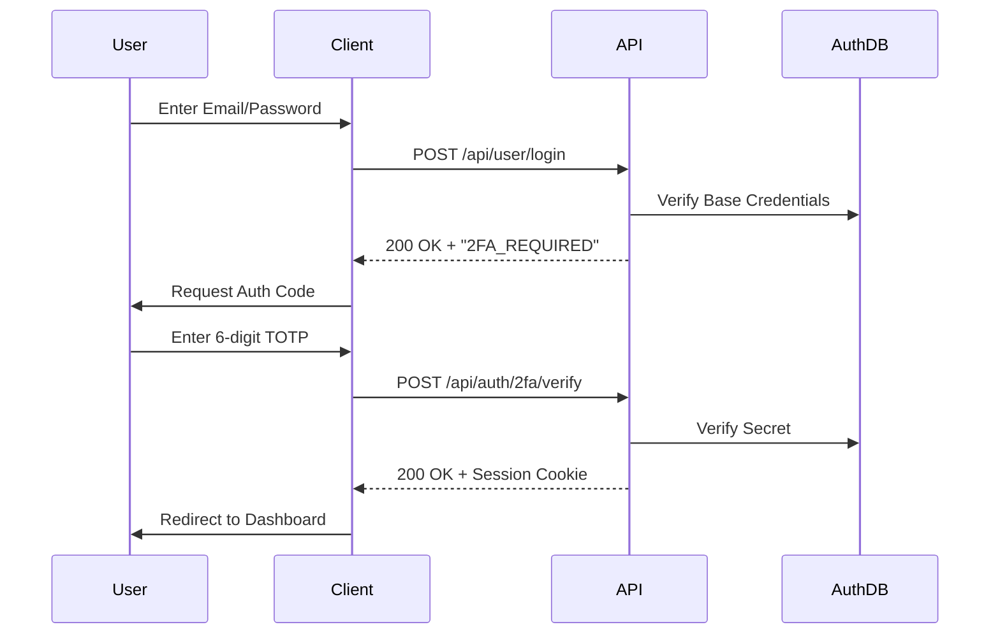

# Two-Factor Authentication API Reference

SveltyCMS provides a **Hardened 2FA System** using Time-based One-Time Passwords (TOTP). Beyond standard implementation, we utilize **Quantum-Resistant Cryptography** for secret storage and backup recovery to ensure long-term identity integrity.

---

## 👥 Choose Your Path

- 🔐 **[Setup Workflow](#1-2fa-setup-flow)** — Provisioning TOTP and backup codes.
- ✅ **[Verification](#2-verification-endpoints)** — Validating codes during login.
- 🆘 **[Recovery](#3-recovery--status)** — Managing backup codes.
- 🛡️ **[Security Architecture](#4-quantum-security-implementation)** — Argon2id and GCM details.

---

## 🚀 Quick Reference

| Method | Endpoint                     | Description                                   |
| :----- | :--------------------------- | :-------------------------------------------- |
| POST   | `/api/auth/2fa/setup`        | Generate new TOTP secret and QR code.         |
| POST   | `/api/auth/2fa/verify-setup` | Validate the first code to enable 2FA.        |
| POST   | `/api/auth/2fa/verify`       | Standard verification during login/actions.   |
| POST   | `/api/auth/2fa/disable`      | Deactivate 2FA for the current user.          |
| GET    | `/api/auth/2fa/backup-codes` | Retrieve 2FA status and remaining code count. |
| POST   | `/api/auth/2fa/backup-codes` | Regenerate a new set of backup codes.         |

---

## 1. 2FA Setup Flow

The setup process requires a two-step handshake: **Handshake** (Setup) → **Confirmation** (Verify Setup).

### A. Initiation (POST)

**Endpoint**: `/api/auth/2fa/setup`
**Response**:

```json
{
  "success": true,
  "data": {
    "secret": "JBSWY3DPEHPK3PXP",
    "qrCodeURL": "otpauth://totp/SveltyCMS:user@example.com?secret=...",
    "backupCodes": ["A1B2C3D4", "..."]
  }
}
```

### B. Confirmation (POST)

**Endpoint**: `/api/auth/2fa/verify-setup`
**Payload**: `{ "verificationCode": "123456", "secret": "..." }`
**Mechanics**: Finalizes the activation in the database. 2FA is not enforced until this step succeeds.

---

## 2. Verification Endpoints

### Standard Validation (POST)

**Endpoint**: `/api/auth/2fa/verify`
**Payload**: `{ "userId": "...", "code": "..." }`
**Logic**:

- Accepts both **6-digit TOTP** codes and **8-character backup codes**.
- Implements a ±30s time window to account for clock drift.
- **Security**: Failed attempts are logged and may trigger account lockout via the Security Middleware.

---

## 3. Recovery & Status

### Regenerate Backup Codes (POST)

**Endpoint**: `/api/auth/2fa/backup-codes`
**Mechanics**: Immediately invalidates all existing backup codes and generates a new set of 10.

> [!WARNING]
> This endpoint returns raw codes **once**. They are immediately hashed in the database using Argon2id and cannot be retrieved again.

---

## 4. Quantum Security Implementation

SveltyCMS 2026 protects 2FA seeds against future decryption by quantum computers.

- **Secret Storage**: TOTP secrets are encrypted at rest using **AES-256-GCM**.
- **Backup Code Hashing**: Each backup code is individually hashed with **Argon2id** (64MB memory-hard).
- **Brute-Force Resistance**: The memory-bound nature of Argon2id prevents quantum speedup (Grover's algorithm), maintaining a high security floor for 15-30+ years.

---

## 5. Sequence Diagrams

### Login with 2FA



---

**Next Steps**: For automated provisioning, see the [SCIM 2.0 API Reference](./scim-v2-api.mdx).
