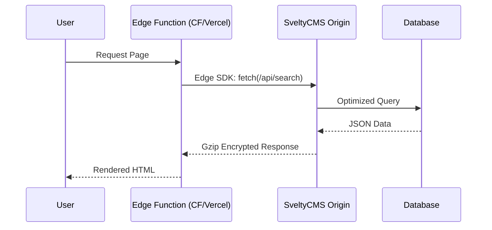

# SveltyCMS Edge SDK

## 1. The Goal
Deliver content with ultra-low latency by fetching data directly from the network edge. The Edge SDK is designed for environments like Cloudflare Workers or Vercel Edge where a full Node.js runtime is unavailable or too heavy.

---

## 2. The Solution

### 🚀 Quick Reference

| Method | Purpose | **Local SDK Equivalent** |
| :--- | :--- | :--- |
| `getEntries` | Fetch multiple entries with filters | `locals.cms.collections.find` |
| `getEntry` | Fetch a single entry by ID | `locals.cms.collections.findById` |
| `graphql` | Execute raw GraphQL queries | `locals.cms.graphql` |

> [!TIP]
> **When to use Edge SDK**: Use this when your frontend is deployed on an Edge Runtime. If your frontend is a standard SvelteKit app, use the **Internal Local SDK** (`locals.cms`) instead for even better performance.

### Initialization

```typescript
import { createEdgeClient } from "@utils/sdk/edge-sdk";

const cms = createEdgeClient({
  host: "https://cms.yourproject.com",
  apiKey: "your_secret_api_key",
});
```

### Fetching Content

```typescript
const posts = await cms.getEntries("posts", {
  limit: 10,
  filter: { status: "published" },
});
```

---

## 3. The Mechanics

### Edge-First Architecture



### Performance Features
- **Zero Dependencies**: No Axios, Lodash, or heavy polyfills. Uses native `fetch`.
- **Sub-millisecond Serialization**: Optimized JSON parsing and DTO (Data Transfer Object) mapping.
- **Smart Timeouts**: Built-in `AbortController` support for edge-runtime safety.

---

**Next Steps**: For real-time updates at the edge, see the [GraphQL WebSocket Subscriptions Reference](./graphql-websocket-subscriptions.mdx).
