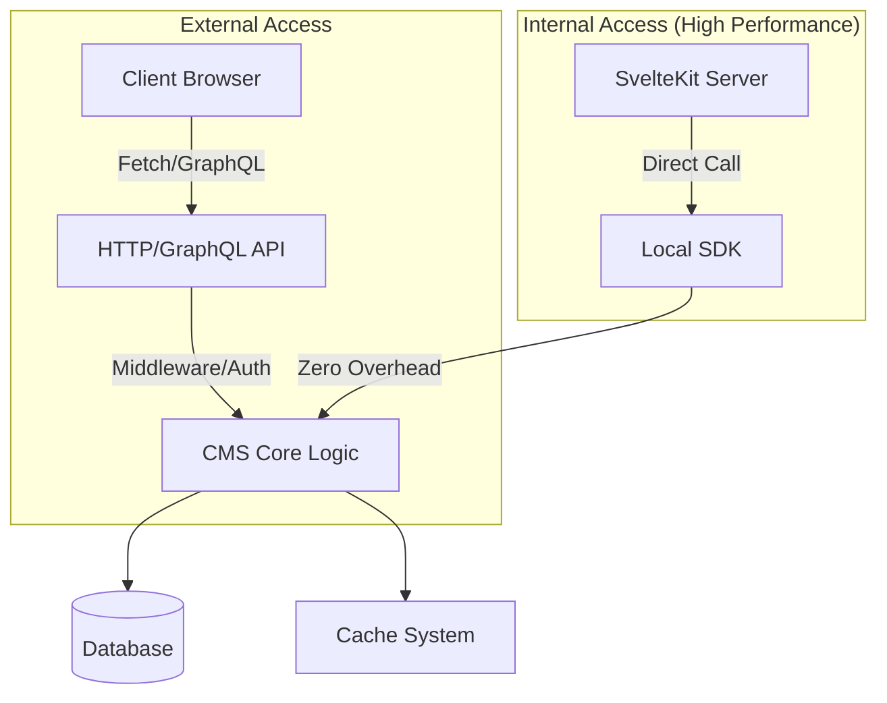

# Local SDK vs HTTP/GraphQL API

SveltyCMS provides two complementary ways to interact with content:

- **External HTTP / GraphQL API** — Secure, public-facing, full middleware stack.
- **Internal Local SDK** — Zero-overhead, server-side only, for maximum performance.



---

## When to Use Which API

| Context                                         | Recommended API    | Typical Latency | Reason                             |
| ----------------------------------------------- | ------------------ | --------------- | ---------------------------------- |
| Client-side (`.svelte` files)                   | **HTTP / GraphQL** | 50–150 ms       | Runs in browser, needs auth & CORS |
| Server-side (`+page.server.ts`, actions, hooks) | **Local SDK**      | **0–5 ms**      | Direct function calls, no overhead |
| Plugin hooks, background jobs                   | **Local SDK**      | **0–5 ms**      | Native execution, full security    |
| External tools / third-party                    | **HTTP / GraphQL** | 80–300+ ms      | Requires API keys / JWT            |

> [!TIP]
> **Rule of thumb**: If your code runs in a file ending with `.server.ts`, **always use** `LocalCMS`. Only use `fetch()` when calling external services. Local calls bypass HTTP-only middleware like **rate limiting**, **firewalls**, and **JSON serialization**, offering near-zero overhead.

---

## Why the Local SDK Exists

The Local SDK (`src/routes/api/cms.ts`) provides a high-performance facade over the system. It:

- **Bypasses HTTP Overhead**: No network stack, no parsing, no serialization.
- **Bypasses HTTP Security**: Since it's internal, it skips rate-limiting and web firewalls.
- **Calls Core Logic Directly**: Executes the same `modifyRequest` pipeline as the HTTP layer.
- **Maintains Consistency**: Triggers identical cache invalidation and real-time events (SSE).

### Example: Server-side Load Function

```typescript
import { LocalCMS } from "@src/routes/api/cms";

export const load = async ({ locals }) => {
  const cms = new LocalCMS(locals.dbAdapter);

  // High-performance internal access
  const posts = await cms.collections.find("posts", {
    limit: 10,
    filter: { status: "publish" },
    tenantId: locals.tenantId
  });

  return { posts };
};
```


### Example: Creating an Entry from a Server Action

```typescript
// Server Action
export const actions = {
  create: async ({ locals, request }) => {
    const formData = await request.formData();
    const data = Object.fromEntries(formData);

    const result = await locals.cms.create("posts", data);

    if (result.success) {
      return { success: true };
    }
    return { error: result.error };
  },
};
```

---

## Technical Details

### Local SDK Guarantees

- All widget logic (`modifyRequest`) executes identically to HTTP requests
- Cache invalidation and content version bump happen automatically
- SSE / WebSocket clients receive real-time updates
- Multi-tenancy and user context are automatically applied

### When You Might Still Use HTTP from Server Code

- Calling an external microservice
- Testing full middleware stack
- Intentionally triggering rate limiting / logging

---

## Best Practices

1. Default to **Local SDK** in all `.server.ts` files.
2. Never do `fetch('/api/...')` inside `+page.server.ts` or actions unless there’s a specific reason.
3. Document any exceptions clearly.
4. **Type safety**: Use the typed `App.Locals` interface so `locals.cms` is fully typed.

---

## Future Improvements

- Bulk operations (`bulkCreate`, `bulkUpdate`)
- Transaction support (where the database adapter allows)
- Local query builder for complex joins
- Telemetry for SDK call monitoring
