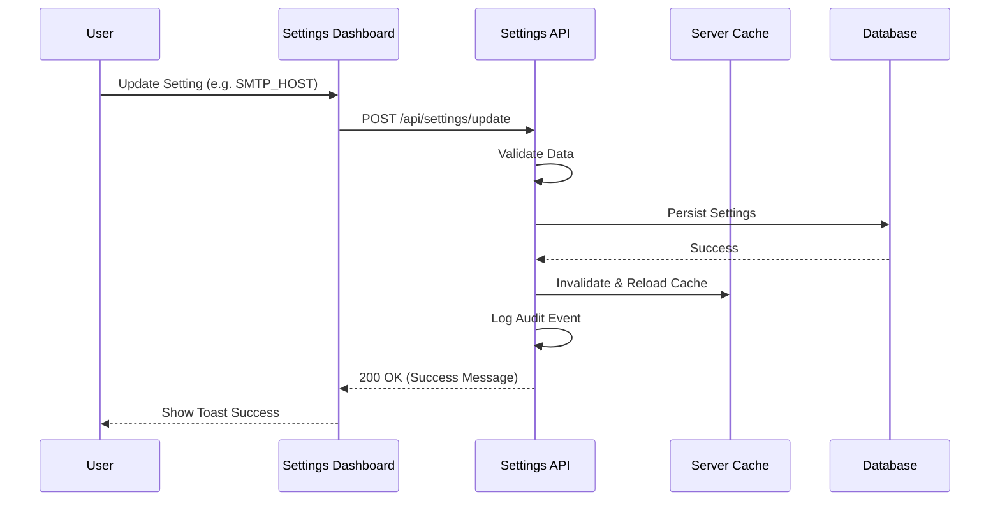

# System Settings API

## Overview

The Settings API provides endpoints for managing system-wide configuration in SveltyCMS. All settings are stored in the database using a database-agnostic adapter, supporting multi-tenancy when enabled.



## Authentication

**Base Path:** `/api/settings`

## Authentication

All settings endpoints require authentication:

```http
Cookie: session=your-session-id
```

Most operations also require admin permissions.

---

## Endpoints

### 1. Get All Settings (Batch)

Retrieves values for all enabled configuration groups authorized for the current user.

#### Request

```http
GET /api/settings/all
```

**Headers:**

```http
Cookie: session=your-session-id
```

**Permissions Required:** Authenticated user (results filtered by permissions)

#### Response

**Success (200):**

```json
{
  "success": true,
  "groups": {
    "site": {
      "SITE_NAME": "My CMS",
      "SITE_URL": "https://example.com"
    },
    "cache": {
      "CACHE_TTL_SCHEMA": 600
    }
  }
}
```

---

### 2. Get Settings by Group

Retrieves settings for a specific configuration group.

#### Request

```http
GET /api/settings/[group]
```

**Path Parameters:**

- `group` (string) - Configuration group name (e.g., `'system'`, `'email'`, `'security'`)

**Headers:**

```http
Cookie: session=your-session-id
```

**Permissions Required:** Authenticated user

#### Response

**Success (200):**

```json
{
  "success": true,
  "data": {
    "SITE_NAME": "My CMS",
    "SITE_URL": "https://example.com",
    "MULTI_TENANT": false
  }
}
```

**Error Responses:**

```json
// 401 Unauthorized
{
  "success": false,
  "message": "Unauthorized"
}

// 404 Not Found - Group doesn't exist
{
  "success": false,
  "message": "Settings group not found"
}

// 500 Internal Server Error
{
  "success": false,
  "message": "Failed to retrieve settings"
}
```

---

### 2. Update Settings

Updates one or more system settings in the database.

#### Request

```http
POST /api/settings/update
```

**Headers:**

```http
Cookie: session=your-session-id
Content-Type: application/json
```

**Body:**

```json
{
  "SITE_NAME": "Updated Site Name",
  "SITE_URL": "https://newdomain.com",
  "MULTI_TENANT": true
}
```

**Permissions Required:** Admin user (recommended)

#### Response

**Success (200):**

```json
{
  "success": true,
  "message": "Settings saved successfully."
}
```

**Error Responses:**

```json
// 401 Unauthorized
{
  "success": false,
  "message": "Unauthorized"
}

// 400 Bad Request - No settings provided
{
  "success": false,
  "message": "No settings provided to update."
}

// 500 Internal Server Error
{
  "success": false,
  "message": "Failed to save settings."
}
```

#### Important Notes

- Settings are validated before being saved
- Cache is automatically invalidated after successful update
- Changes take effect immediately across the system
- Multi-tenant mode: Some settings may be tenant-specific

---

## Common Settings Groups

### System Settings (`system`)

```json
{
  "SITE_NAME": "string",
  "SITE_URL": "string",
  "MULTI_TENANT": "boolean",
  "DEFAULT_LANGUAGE": "string"
}
```

### Database Settings (`database`)

```json
{
  "DB_TYPE": "mongodb | postgres | mysql",
  "DB_HOST": "string",
  "DB_PORT": "number",
  "DB_NAME": "string"
}
```

### Email Settings (`email`)

```json
{
  "SMTP_HOST": "string",
  "SMTP_PORT": "number",
  "SMTP_USER": "string",
  "SMTP_FROM": "string"
}
```

### Security Settings (`security`)

```json
{
  "SESSION_TIMEOUT": "number (minutes)",
  "PASSWORD_MIN_LENGTH": "number",
  "ENABLE_2FA": "boolean",
  "RATE_LIMIT_ENABLED": "boolean"
}
```

---

## Database-Agnostic Implementation

The Settings API uses a database-agnostic adapter:

```typescript
// Settings are stored and retrieved via the adapter interface
const result = await db.settings.getSettings(group);
const updateResult = await db.settings.updateSettings(settingsData);
```

This means you can swap databases (MongoDB, PostgreSQL, MySQL) without changing API code.

---

## Multi-Tenancy Support

When `MULTI_TENANT` mode is enabled, SveltyCMS implements a hybrid isolation model:

- **Site-Specific Settings**: Settings like Appearance, Languages, and Site Config are seamlessly scoped to the specific `tenantId`. A tenant admin can only view and modify their own settings.
- **Infrastructure Settings**: Critical system groups (e.g., `database`, `security`, `email`) apply globally across the CMS. Access to these groups is strictly restricted to **super-admins**.
- **Tenant ID Resolution**: The `tenantId` is derived from the user's session context or dynamically injected by the middleware.

**Tenant-Specific Settings Example:**

```http
GET /api/settings/site
# Automatically scoped to the current tenant
```

---

## Security Considerations

### Sensitive Settings

Some settings contain sensitive data (e.g., `JWT_SECRET_KEY`, `DB_PASSWORD`):

- **Masking:** Sensitive fields are automatically masked in the UI with `********`.
- **Environment Overrides:** Fields marked as `readonly` (like `JWT_SECRET_KEY`) are typically managed via environment variables and cannot be modified through the API.
- **API Response:** Sensitive fields are included in API responses but should be handled securely.

### Audit Logging

All modifications to system settings are logged for security auditing.

- **PUT /api/settings/[group]**: Logs the group ID, user ID, tenant ID, and the specific changes made.
- **DELETE /api/settings/[group]**: Logs the reset action.

Example log entry:

```
info: Settings group 'email' updated by user user123 for tenant default { changes: { SMTP_HOST: "smtp.new-host.com" } }
```

### Settings Validation

All settings are validated before being saved:

- Type checking (string, number, boolean)
- Format validation (URLs, emails)
- Range validation (min/max values)
- Dependency validation (some settings require others)

---

## Cache Management

Settings are cached for performance:

- **Cache Duration:** Configurable (default: until invalidated)
- **Invalidation:** Automatic after updates
- **Manual Invalidation:** Available via internal API

**Cache Behavior:**

1. First request: Load from database, cache result
2. Subsequent requests: Serve from cache
3. After update: Cache invalidated, next request re-loads

---

## Testing

### Manual Testing with cURL

**Get Settings:**

```bash
curl -X GET https://your-domain.com/api/settings/system \
  -H "Cookie: session=your-session-cookie"
```

**Update Settings:**

```bash
curl -X POST https://your-domain.com/api/settings/update \
  -H "Cookie: session=your-session-cookie" \
  -H "Content-Type: application/json" \
  -d '{
    "SITE_NAME": "My New CMS",
    "SITE_URL": "https://newdomain.com"
  }'
```

### JavaScript Example

```javascript
// Get settings
const response = await fetch("/api/settings/system", {
  credentials: "include",
});
const { data } = await response.json();

// Update settings
const updateResponse = await fetch("/api/settings/update", {
  method: "POST",
  headers: {
    "Content-Type": "application/json",
  },
  credentials: "include",
  body: JSON.stringify({
    SITE_NAME: "Updated Name",
    MULTI_TENANT: true,
  }),
});
```

---

## Related Documentation

- [System Configuration Guide](/docs/admin/system-configuration)
- [Multi-Tenancy Setup](/docs/admin/multi-tenancy)
- [Database Architecture](/docs/dev/database-architecture)
- [Security Best Practices](/docs/security/best-practices)

---

## Implementation Details

For implementation details, see:

- `src/routes/api/settings/update/+server.ts` - Update endpoint
- `src/routes/api/settings/[group]/+server.ts` - Get endpoint
- `src/stores/global-settings.ts` - Settings store and cache
- `src/databases/db-interface.ts` - Database adapter interface
