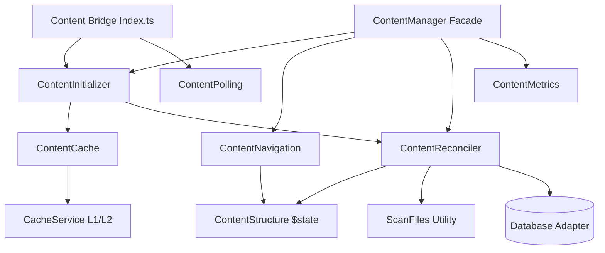

# Content System Architecture

The Content System is the core of SveltyCMS, responsible for managing, indexing, and serving content and collections. It leverages Svelte 5 runes for fine-grained reactivity and supports multi-tenant isolation at the filesystem level.

## Modular Architecture (2026 Refactor)

To ensure maintainability and tree-shakability, the Content System has been decomposed into specialized, decoupled modules. The legacy `index.ts` layer has been refactored into a thin bridge, delegating all complex logic to the following subsystems:

### Core Components

#### 1. Content Manager Facade (`src/content/content-manager.ts`)

A thin coordinator providing a stable public API. It orchestrates the various specialized modules to ensure consistent data flow across the CMS.

#### 2. Content Structure (`src/content/content-structure.svelte.ts`)

The single source of truth for in-memory content state. It uses **Svelte 5 runes** (`$state`, `$derived`) to provide reactive access to the content node map and path lookup map. It includes a `sync()` method for atomic bulk updates.

#### 3. Content Initializer (`src/content/content-initializer.ts`)

Manages the system lifecycle (IDLE → INITIALIZING → READY). It handles tenant-specific bootstrapping and implements self-healing retries with exponential backoff.

#### 4. Content Reconciler (`src/content/content-reconciler.ts`)

A **database-agnostic** module responsible for synchronizing filesystem definitions (`.compiledCollections/`) with the database. It delegates filesystem scanning to the high-performance `scan-files.ts` utility.

#### 5. Content Polling (`src/content/content-polling.svelte.ts`)

A client-side service that synchronizes local state with the server by polling the `/api/content/version` endpoint. It triggers a reactive refresh only when a version mismatch is detected.

#### 6. Content Navigation (`src/content/content-navigation.ts`)

Provides pure tree operations, including breadcrumb generation and descendant lookups, reading directly from the reactive `ContentStructure`.

---

## Reactivity Model (Svelte 5)

SveltyCMS uses a **Signal-based Reactivity Model**:

1.  **State Tracking**: The system exposes reactive state via Svelte 5 runes.
2.  **Version Propagation**: When content is modified on the server, the `contentVersion` increments.
3.  **Client Sync**: The `ContentPolling` service detects version increments and triggers `contentInitializer.refresh()`, updating local stores without a full page reload.
4.  **Fine-Grained Updates**: Components using `collections` or `contentStructure` re-render only for the specific nodes or paths that changed.

---

## Performance & Scaling

- **Smart Filesystem Scanning**: The reconciler uses a parallelized recursive scanner optimized for both `.ts` (development) and `.js` (production) files.
- **Dual-Layer Caching**: Integrates with the global `CacheService` for sub-millisecond schema lookups using L1 (Redis) and L2 (In-memory) caches.
- **Tree-Shakable API**: By decomposing the monolithic manager, the client bundle is reduced by isolating server-side reconciliation logic from client-side state.

---

## Documentation Updates

- **API Documentation**: See [Collection API Reference](../api/collection-api.mdx) for endpoint details.
- **Developer Guide**: See [Collection Builder Guide](../guides/development/collection-builder.mdx) for UI-driven schema management.
