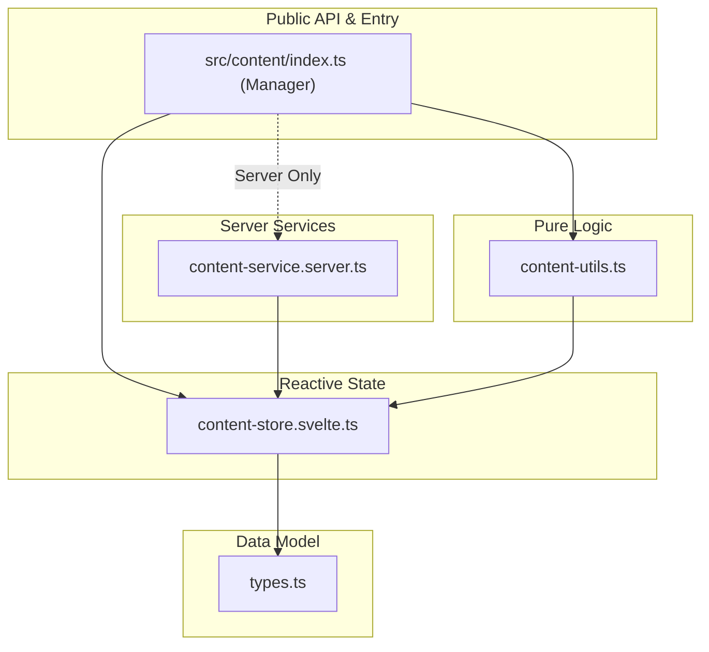

# Content System Architecture

The Content System is the core of SveltyCMS, responsible for managing, indexing, and serving content and collections. In the 2026 consolidation, it was refactored from 19 disparate files into 5 core, tree-shakable pillars to eliminate architectural complexity and improve build performance.

## Consolidated 5-Pillar Architecture

The system is organized into specialized modules that strictly separate reactive state, server-side logic, and public APIs.

### The 5 Pillars

#### 1. Public API & Entry Point (`src/content/index.ts`)

The primary entry point and **Content Manager**.

- **Lifecycle**: Orchestrates initialization (IDLE → READY) and self-healing.
- **Caching**: Manages L1/L2 cache population and invalidation.
- **Context**: Provides Svelte component context (`useContent`).
- **Consolidation**: Merges legacy `content-manager`, `content-initializer`, `content-cache`, and `content-context`.

#### 2. Content Store (`src/content/content-store.svelte.ts`)

The single reactive source of truth.

- **State management**: Uses Svelte 5 runes (`$state`, `$derived`) for high-performance reactivity.
- **Consolidation**: Merges legacy `content-structure`, `content-collections`, and `content-polling`.
- **Key features**: Node indexing, collection sorting, and browser-side version polling.

#### 3. Content Utils (`src/content/content-utils.ts`)

Pure, stateless logic and monitoring.

- **Navigation**: Breadcrumbs, tree traversal, and progressive navigation loading.
- **Metrics**: Performance tracking and health diagnostics.
- **Consolidation**: Merges legacy `content-navigation`, `content-metrics`, and shared `utils`.

#### 4. Content Service (Server) (`src/content/content-service.server.ts`)

Heavy lifting restricted to the server.

- **Reconciliation**: Syncs filesystem definitions with the database.
- **Processing**: High-performance JS module evaluation and filesystem scanning.
- **Security**: Bound by the `.server.ts` suffix to ensure zero leak to the client bundle.
- **Consolidation**: Merges legacy `content-reconciler`, `scan-files`, and `module-processor`.

#### 5. Types (`src/content/types.ts`)

Universal type definitions for the entire system.

- **Interfaces**: Defines `ContentNode`, `Schema`, `Field`, and `NavigationNode`.
- **Validation**: Centralized types for system-wide consistency.

---

## Reactivity Model (Svelte 5)

SveltyCMS leverages a signal-driven reactivity model:

1. **Signal Generation**: The `contentStore` emits signals when nodes change or a new version is polled.
2. **Granular Consumption**: Components using `useContent()` or `contentStore` react only to specific updates.
3. **Zero-Runtime Overhead**: Svelte 5 runes eliminate the need for legacy stores or complex subscription management.

---

## Performance Benefits

- **Better Tree-Shaking**: Server-side code is physically isolated, reducing client bundle size.
- **Reduced Complexity**: 19 files reduced to 5 logical units.
- **Faster Cold Starts**: Optimized reconciliation logic with parallel scanning.
- **Sub-10ms Persistence**: Highly optimized database operations for structure updates.
