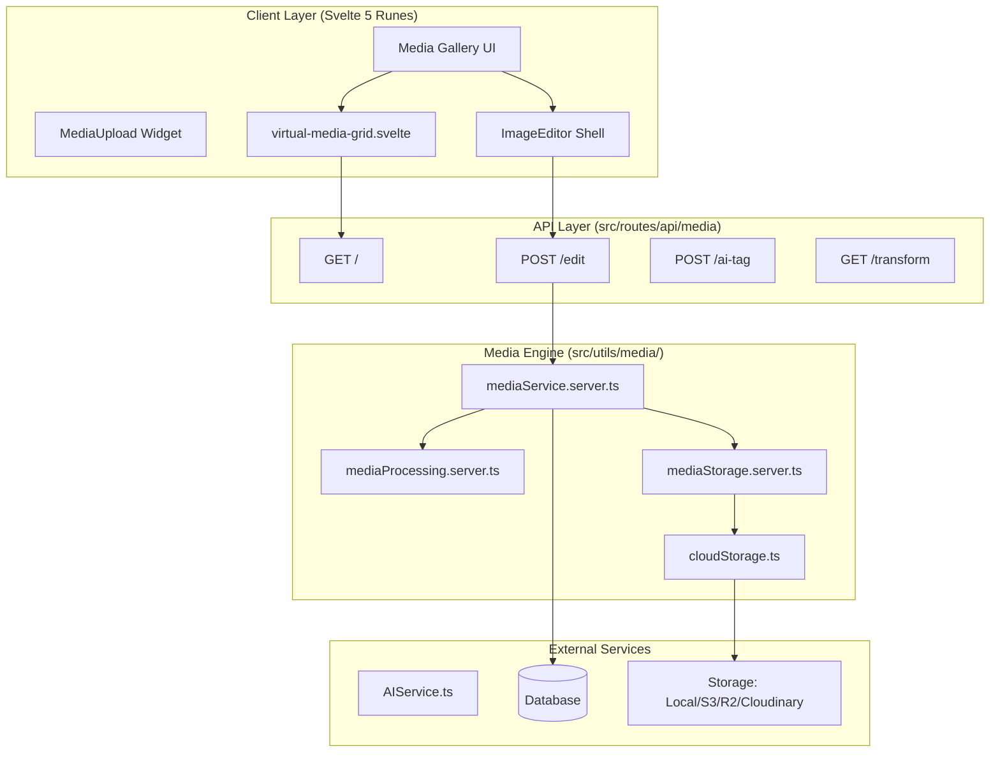
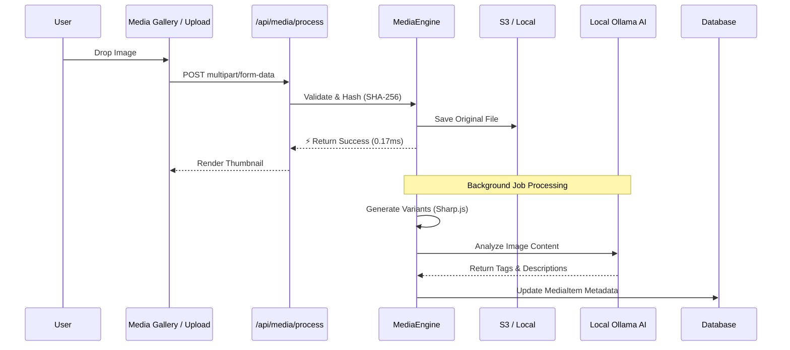

# Media System Architecture & Guide

The SveltyCMS Media system is a decoupled, high-performance engine optimized for Svelte 5 and Sharp.js. It balances enterprise-grade Digital Asset Management (DAM) requirements with a seamless, accessible user experience.

---

## 🏗️ Layered Architecture

The system follows a strict 3-layer architecture to ensure storage and framework portability.

---

## 📤 Media Upload & AI Processing Pipeline

The ingestion pipeline is designed to never block the user UI. Uploads execute critical persistence instantly, while heavy lifting (like AI tagging and image variants) runs asynchronously.

### 1. High-Performance Client Rendering

- **Virtual Scrolling**: `virtual-media-grid.svelte` handles 10,000+ files by rendering only visible items.
- **Lazy Loading**: Images load only when visible using Intersection Observer.
- **On-the-Fly Transforms**: Responsive images via `GET /api/media/transform` using Sharp.js.

### 2. AI-Native Tagging (Ollama Integration)

Unlike standard CMS platforms that use simple keyword matching, SveltyCMS features **native AI image analysis**.

- **Fully Automated**: Triggers automatically during background job processing (`MediaService.saveMedia`).
- **Privacy-First**: Uses local Ollama inference (`llava`), analyzing on your own infrastructure without exposing raw images to third-party APIs.

### 3. Enterprise DAM Capabilities

- **Batch Image Processor**: Apply Vivid, B&W, Sepia, and HDR filters to 100+ images simultaneously.
- **Deep Metadata Extraction**: Automatically parses **EXIF, IPTC, and XMP** data into searchable database fields.
- **Document Thumbnails**: Automated extraction of the first page of PDFs as a high-quality preview (Requires `imagemagick` and `ghostscript`).

---

## 🎨 Image Editor Integration

The gallery is deeply integrated with the canvas-based Image Editor:

- **Non-Destructive Editing**: Originals are preserved; edits are saved as variants.
- **Interactive Focal Points**: Visual crosshair selection for art-directed cropping. This focal point is injected natively into our GraphQL API delivery.
- **Watermarking**: Automatic application of collection-level watermark presets.

---

## ⚡ Performance Benchmarks

For comprehensive performance details regarding media hashing, metadata extraction, and multi-scale resizing block times, please reference the central [Benchmarks Report](../project/benchmarks.mdx).

---

## ⌨️ Accessibility & Hotkeys

The Media System implements **WCAG 3.0 Functional Performance** principles via a centralized hotkey manager.

| Shortcut  | Action        | Scope              |
| :-------- | :------------ | :----------------- |
| `Mod + F` | Focus Search  | Gallery            |
| `Mod + A` | Select All    | Gallery / Widget   |
| `Mod + O` | Open Library  | MediaUpload Widget |
| `Delete`  | Bulk Delete   | Gallery (Selected) |
| `Escape`  | Clear Filters | Gallery / Editor   |
| `Mod + Z` | Undo Edit     | ImageEditor        |

---

## 📚 API Reference

For detailed developer endpoints (upload, transform, AI-tag, focal points), read the comprehensive [**Media API Reference**](../api/media-api.mdx).
