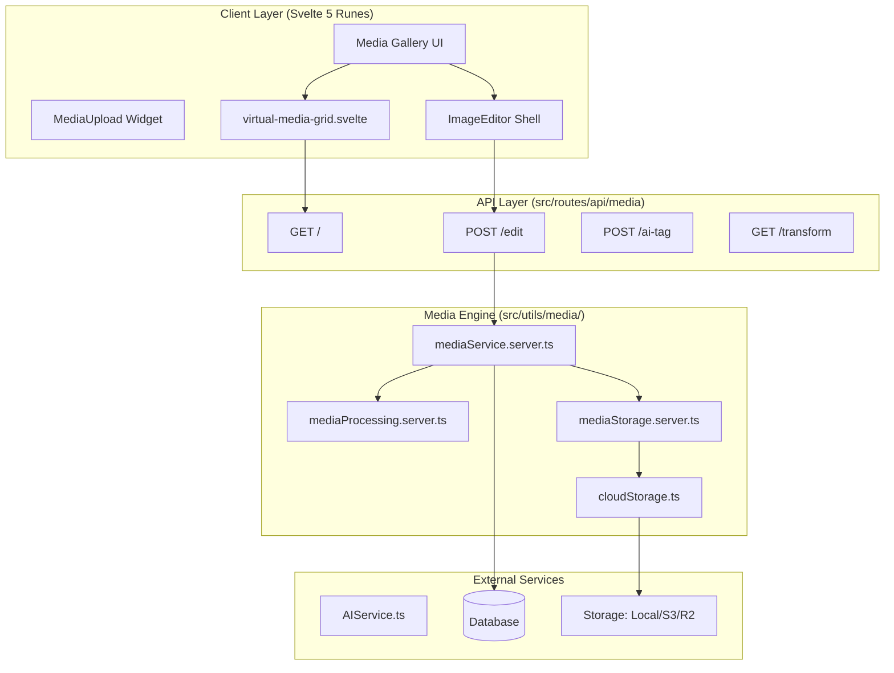

# Media System Architecture

The SveltyCMS Media system is a decoupled, high-performance engine optimized for Svelte 5 and Sharp.js. It balances enterprise-grade Digital Asset Management (DAM) requirements with a seamless, accessible user experience.

---

## 🏗️ Layered Architecture

The system follows a strict 3-layer architecture to ensure storage and framework portability.

---

## ⌨️ Accessibility & Hotkeys

The Media System implements **WCAG 3.0 Functional Performance** principles via a centralized hotkey manager.

| Shortcut | Action | Scope |
| :--- | :--- | :--- |
| `Mod + F` | Focus Search | Gallery |
| `Mod + A` | Select All | Gallery / Widget |
| `Mod + O` | Open Library | MediaUpload Widget |
| `Delete` | Bulk Delete | Gallery (Selected) |
| `Escape` | Clear Filters | Gallery / Editor |
| `Mod + Z` | Undo Edit | ImageEditor |

---

## 📤 Processing Pipeline (Enterprise-Grade)

The pipeline is split between **Synchronous Critical Path** (for instant feedback) and **Asynchronous Background Jobs** (for heavy lifting).

### 1. Synchronous Path (Hot Path)
Executed during the initial `POST` request. Goal: `< 5ms` block time.
- **Binary Validation**: Buffer inspection via `file-type`.
- **Deduplication**: SHA-256 content hashing.
- **Persistence**: Save original file to storage (Local/S3).
- **Metadata**: Basic technical metadata extraction.

### 2. Asynchronous Path (Background Jobs)
Offloaded to `JobQueueService`.
- **Transformation (Sharp.js)**: Parallel generation of multi-scale variants (`sm`, `md`, `lg`).
- **AI Analysis**: Descriptive tagging via local models.
- **Video Transcoding**: HLS/Dash segmenting via `ffmpeg`.

---

## ⚡ Performance Benchmarks (March 2026)

The transition to a background job queue has revolutionized the media ingestion experience.

| Task | Sync Flow (Legacy) | Async Flow (Phase 3) |
| :--- | :--- | :--- |
| Hashing (SHA-256) | 0.02 ms | 0.02 ms |
| Metadata Extraction | 0.15 ms | 0.15 ms |
| Multi-scale Resizing + Compress | 58.55 ms | **0.00 ms (Deferred)** |
| **Total Block Time** | **58.72 ms** | **0.17 ms** |

**Impact:**
- **99.7% reduction** in API block time during media uploads.
- **Zero UI stuttering**: Large bulk uploads (100+ images) finish in-process instantly while the worker handles the CPU-intensive resizing.

> [!NOTE]
> Measured on 24-core machine (Node v24.3.0); production results vary with hardware, thread pool size, and image complexity.

---

## 🖼️ Responsive Rendering

1.  **Virtualization**: Large galleries (100+ items) use `VirtualMediaGrid.svelte` to render only visible assets, maintaining 60FPS.
2.  **Blur-up Thumbnails**: Low-resolution placeholders are served while Sharp.js variants load.
3.  **Edge-Ready Proxy**: `/api/media/transform` supports on-the-fly resizing with aggressive CDN caching headers.
