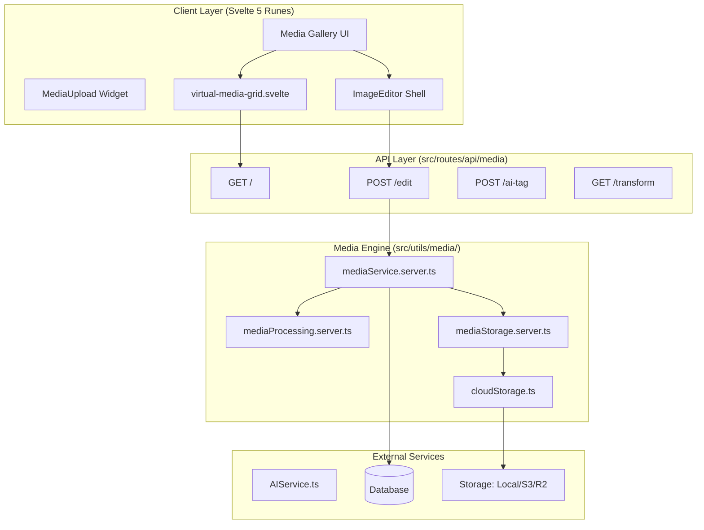

# Media System Architecture

The SveltyCMS Media system is a decoupled, high-performance engine optimized for Svelte 5 and Sharp.js. It balances enterprise-grade Digital Asset Management (DAM) requirements with a seamless, accessible user experience.

---

## 🏗️ Layered Architecture

The system follows a strict 3-layer architecture to ensure storage and framework portability.

---

## ⌨️ Accessibility & Hotkeys

The Media System implements **WCAG 3.0 Functional Performance** principles via a centralized hotkey manager.

| Shortcut | Action | Scope |
| :--- | :--- | :--- |
| `Mod + F` | Focus Search | Gallery |
| `Mod + A` | Select All | Gallery / Widget |
| `Mod + O` | Open Library | MediaUpload Widget |
| `Delete` | Bulk Delete | Gallery (Selected) |
| `Escape` | Clear Filters | Gallery / Editor |
| `Mod + Z` | Undo Edit | ImageEditor |

---

## 📤 Processing Pipeline (Modernized)

When a file is processed (via `POST /api/media/edit` or `saveMedia`), it follows this sequence:

1.  **Binary Validation**: Uses `file-type` for deep buffer inspection to prevent extension spoofing.
2.  **Deduplication**: Generates SHA-256 content hashes. Existing assets are reused to prevent storage bloat.
3.  **Metadata & AI**:
    - Technical metadata extraction (EXIF/IPTC).
    - **AI Auto-Tagging**: Local Ollama models generate descriptive badges.
    - **Focal Point**: Persistent X/Y coordinates for smart cropping.
4.  **Transformation (Sharp.js & ffmpeg)**:
    - **Adaptive Transcoding Hub**: Multi-resolution HLS/MP4 pipeline for video assets.
    - **Batch Processing**: Parallelized Sharp.js filter application (Vivid, B&W, etc.).
    - Generates multi-scale image variants (`sm`, `md`, `lg`).
    - Supports `new` (versioning) vs `overwrite` (destructive) save behaviors.
5.  **Persistence**: Scoped by `tenantId` and `collectionName` for isolated DAM organization.

---

## 🖼️ Responsive Rendering

1.  **Virtualization**: Large galleries (100+ items) use `VirtualMediaGrid.svelte` to render only visible assets, maintaining 60FPS.
2.  **Blur-up Thumbnails**: Low-resolution placeholders are served while Sharp.js variants load.
3.  **Edge-Ready Proxy**: `/api/media/transform` supports on-the-fly resizing with aggressive CDN caching headers.
