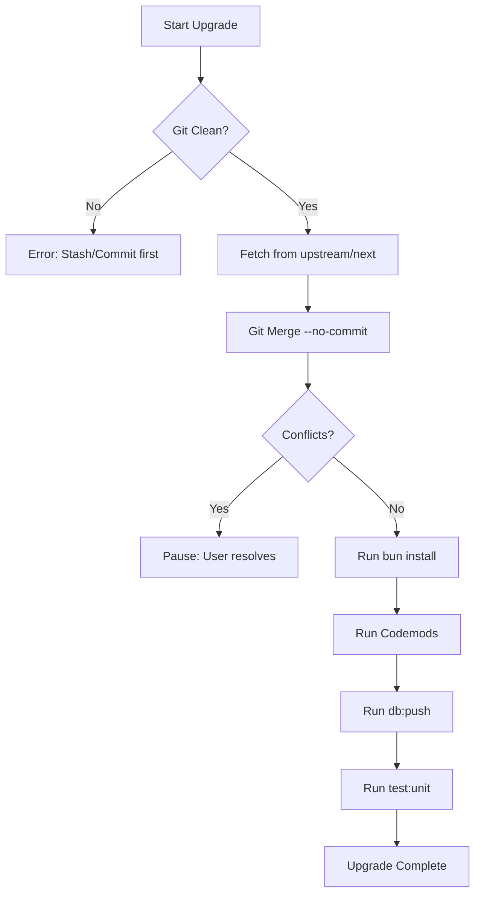

# Upgrading SveltyCMS

SveltyCMS is designed to be upgraded easily while preserving your custom collections and configurations. We provide a CLI tool to automate the process, including dependency updates, database migrations, and **automated code transformations (codemods)**.

## The Upgrade Process

The upgrade tool performs the following steps:



1. **Git Verification**: Ensures you are in a valid Git repository and have no uncommitted changes.
2. **Upstream Fetch**: Fetches the latest changes from the official SveltyCMS repository.
3. **Pre-commit Merge**: Merges changes into your local branch without committing, allowing you to review.
4. **Dependency Refresh**: Runs `bun install` to ensure all new packages are installed.
5. **Codemods**: Automatically executes scripts in `scripts/codemods/` to handle breaking changes.
6. **Database & Tests**: Runs `db:push` and `test:unit` to ensure everything is working correctly.

## How to Run the Upgrade

Run the following command in your project root:

```bash
bun run scripts/upgrade.ts
```

### Advanced Options

| Flag            | Description                                          |
| --------------- | ---------------------------------------------------- |
| `--dry-run`     | See what would happen without making any changes.    |
| `--skip-tests`  | Do not run the unit test suite after upgrade.        |
| `--skip-db`     | Do not run `db:push` after upgrade.                  |
| `--force`       | Ignore uncommitted changes (not recommended).        |
| `--branch=NAME` | Upgrade from a specific branch (defaults to `next`). |

## Codemods

SveltyCMS uses "codemods" to automate the tedious parts of an upgrade. If a new version renames a property in a configuration file or changes a component's API, a codemod script will automatically update your local files during the upgrade.

You can find available codemods or add your own in the `scripts/codemods/` directory.

## Best Practices

- **Backup First**: While the script is safe, always ensure your important data is backed up.
- **Review Changes**: After the script finishes, use `git diff` to review the changes before committing.
- **Resolve Conflicts**: If the merge fails, resolve conflicts in your IDE, then run `bun install` and `scripts/upgrade.ts` again.

## Troubleshooting

### "Not a git repository"

The upgrade tool requires Git. If you downloaded SveltyCMS as a ZIP, initialize a repository first:

```bash
git init
git remote add origin https://github.com/SveltyCMS/SveltyCMS.git
git fetch origin
git checkout -b next origin/next
```

### Dependency Errors

If `bun install` fails after an upgrade, try clearing the cache:

```bash
rm -rf node_modules/.vite
bun install
```
