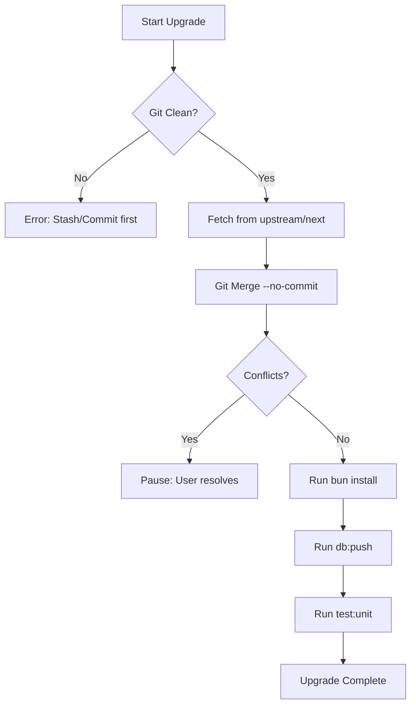

# Upgrading SveltyCMS

SveltyCMS is designed to be upgraded easily while preserving your custom collections and configurations. We provide a CLI tool to automate the process.

## The Upgrade Process

The upgrade tool performs the following steps:



1. **Git Verification**: Ensures you are in a valid Git repository.
2. **Upstream Fetch**: Fetches the latest changes from the official SveltyCMS `next` branch.
3. **Pre-commit Merge**: Merges changes into your local branch without committing, allowing you to review.
4. **Dependency Refresh**: Runs `bun install` to ensure all new packages are installed.

## How to Run the Upgrade

Run the following command in your project root:

```bash
bun run scripts/upgrade.ts
```

### Handling Conflicts

If the upgrade script detects conflicts:
1. Open your IDE (e.g., VS Code).
2. Use the "Merge Editor" to resolve conflicts.
3. Once resolved, stage the changes: `git add .`
4. Run `bun install` to ensure everything is in sync.
5. Finish the commit: `git commit -m "chore: upgrade SveltyCMS"`

## Best Practices

- **Backup First**: While the script is safe, always ensure your important data is backed up.
- **Run Tests**: After upgrading, run the full test suite:
  ```bash
  bun run check && bun run test:unit
  ```
- **Review migrations**: Check if there are any new database schema changes that need to be pushed:
  ```bash
  bun run db:push
  ```

## Troubleshooting

### "Not a git repository"
The upgrade tool requires Git. If you downloaded SveltyCMS as a ZIP, initialize a repository first:
```bash
git init
git remote add origin https://github.com/SveltyCMS/SveltyCMS.git
git fetch origin
git checkout -b next origin/next
```

### Dependency Errors
If `bun install` fails after an upgrade, try clearing the cache:
```bash
rm -rf node_modules/.vite
bun install
```
