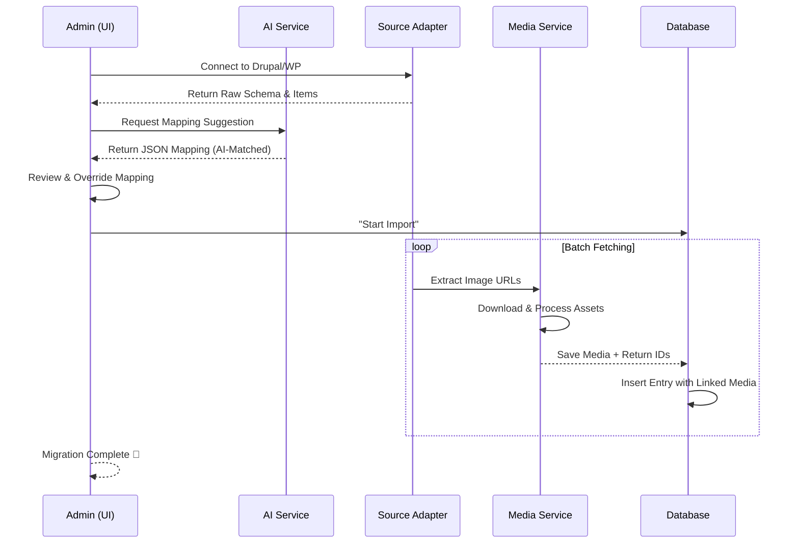

## 🔄 Migration Workflow

## 🚀 Key Features

- **AI-Powered Mapping**: Automatically suggests which SveltyCMS widgets should match your external source fields.
- **Media Auto-Download**: Automatically fetches remote images from your old site and stores them in the SveltyCMS Media Gallery.
- **One-Click Connect**: Connect directly to Drupal (JSON:API) or WordPress (REST API) endpoints.
- **Instant Scaffold**: Automatically analyze the remote database structure and generate a matching SveltyCMS `.ts` collection schema with appropriate widget suggestions.
- **Dry-Run Mode**: Preview your mapping and data before committing to the database.

---

## 🛠 How to Use

### Step 1: Source Configuration

Navigate to **Config > Smart Importer** (`/config/importer`).

1. **Source Type**: Select either "Drupal" or "WordPress".
2. **Source URL**: Enter the base URL of your existing site (e.g., `https://my-old-blog.com`).
3. **API Key**: If your source API is protected, enter the Bearer token or Basic Auth credentials.
4. **Content Type**: Enter the machine name of the content type (e.g., `article` for Drupal or `posts` for WordPress).
5. **Target Collection**: Choose the SveltyCMS collection where you want the data to land.
   > [!TIP]
   > **Instant Scaffold**: If you haven't created the target collection yet, use the **Scaffold** button to auto-generate a new collection based on the external fields.

### Step 2: Field Mapping

Once you click "Next", the AI will analyze both your source and target schemas.

- **Automatic Suggestions**: The AI will fill in the mappings for you.
- **Manual Overrides**: You can manually change the target field or apply a **Media Transform** if the source field is a URL to an image.
- **✨ AI Re-Map**: If you've changed your target collection, click this to get fresh suggestions.

### Step 3: Execution

Review the summary and click **Start Import**. The system will:

1. Fetch the data in batches.
2. Download and process any remote media.
3. Link the media to your new entries.
4. Insert the records into your database.

---

## 🔒 Security & Performance (v2026 Enhanced)

- **Tenant Isolation**: Imports are strictly scoped to your current `tenantId`.
- **Validation**: All imported data is run through your widget's Valibot schemas to ensure integrity.
- **Durable Batch Processing**: Large migrations use the **JobQueueService** to process items in background chunks.
- **Progress Feedback**: Editors get real-time status updates (0-100%) as the migration worker moves through the dataset.
- **Concurrency Protection**: The importer automatically yields if the server's `IMPORT_CONCURRENT_MAX` limit is reached, ensuring site stability for other users.

## 📡 API Reference

The importer is powered by the following endpoint:
`POST /api/importer/external`

Refer to the [API Documentation](../../api/export-import-api.mdx) for programmatic usage details.
