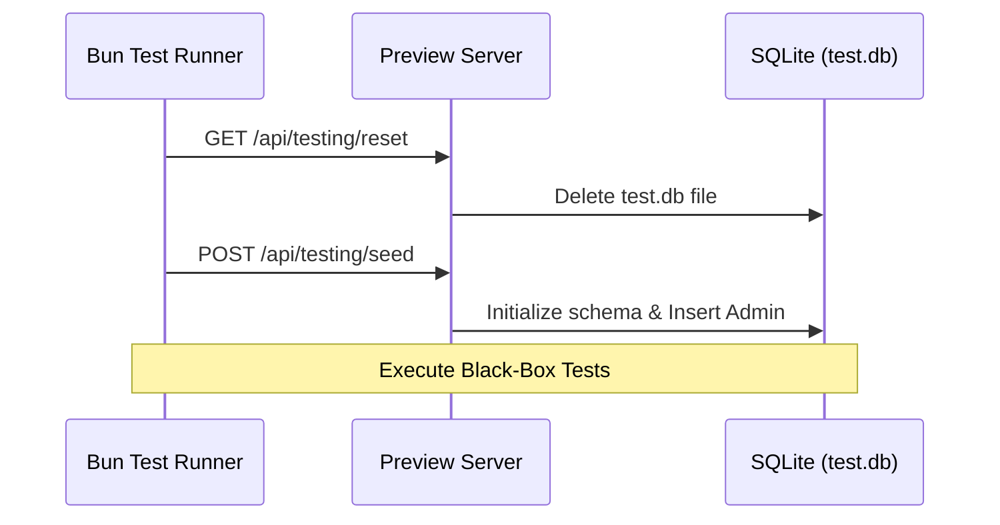

# Database & Authentication Testing Guide

## Overview

SveltyCMS uses a **database-agnostic architecture** via the `IDBAdapter` interface. In 2026, we standardized on a **SQLite-First** local testing strategy and strict **Network Consistency (127.0.0.1)** to ensure 100% deterministic results across all environments.

This guide covers:

- **SQLite (Default)**: Primary driver for unit and integration tests.
- **MongoDB / Postgres / MariaDB**: Verified via CI matrix testing.
- **Strict Isolation**: How we protect production data.
- **Network Standardization**: Why we use `127.0.0.1` exclusively for testing.

## The SQLite-First Strategy (2026)

Previously, local testing required a running MongoDB instance, which often led to authentication errors or "Server Busy" timeouts.

### Why SQLite for Tests?

1. **Zero Latency**: No network overhead; tests run in milliseconds.
2. **Zero Config**: No Docker or local Mongo service required.
3. **Deterministic**: Every test run starts with a fresh file-based database (`sveltycms_test.db`).

---

## Test Architecture

### Isolation Flow

SveltyCMS enforces a hard boundary between production and testing:

1. **TEST_MODE**: Automatically enabled during `bun run test:*`.
2. **Config Redirect**: The system is hard-coded to look for `config/private.test.ts` when testing.
3. **Safety Guard**: `src/databases/db.ts` will throw a fatal error if it detects `config/private.ts` (Live) being loaded while in test mode.
4. **Network Lock**: Standardization on `127.0.0.1` prevents IPv6 auto-resolution (common on macOS/Windows) from mismatched port binding.

### Database Test Sequence



---

## Authentication System Tests

**File:** `tests/unit/auth/*.test.ts` & `tests/integration/api/user.test.ts`

### Key Test Areas:

#### 1. Argon2id Password Security

- ✅ Quantum-resistant hashing verification.
- ✅ Timing attack resistance (constant-time comparisons).

#### 2. Session & Rotation

- ✅ Secure cookie handling.
- ✅ Session rotation on privilege change.
- ✅ Automatic cleanup of expired sessions.

#### 3. Database Module Integrity

- ✅ **ensureCollections**: All adapter tests must call `await db.ensureCollections()` to guarantee schema synchronization before execution.
- ✅ **Micro-Telemetry**: Verification that adapters return `executionTime` in microseconds.

---

## Running Database Tests

### 1. The Standard Suite (SQLite)

This is the recommended way to test locally:

```bash
bun run test:integration
```

The script will automatically set `DB_TYPE=sqlite` and run the suite against `127.0.0.1:4173`.

### 2. Testing Other Adapters

To verify MongoDB or PostgreSQL locally:

```bash
DB_TYPE=mongodb DB_HOST=127.0.0.1 bun run test:integration
```

---

## Troubleshooting

### "UNIQUE constraint failed: roles._id"

This usually happens if multiple Playwright workers try to seed the database at once.
**Fix**: `playwright.config.ts` is configured with `workers: 1` for setup-related tests.

### "Database connection failed"

Ensure your `config/private.test.ts` has the correct credentials. Always use `127.0.0.1` instead of `localhost` to avoid IPv6 resolution issues.

---

## Related Documentation

- [Test Status Report](./test-status.mdx)
- [Testing Index](./index.mdx)
- [API Testing](./api-testing.mdx)
