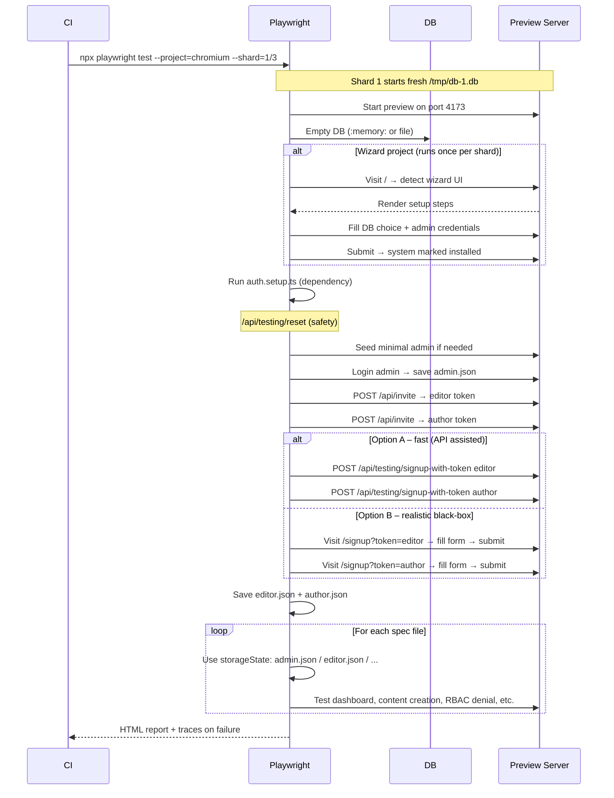

# Black-box E2E – How the layers connect

```mermaid
sequenceDiagram
    participant CI
    participant PW as Playwright
    participant DB
    participant App as Preview Server

    CI->>PW: npx playwright test --project=chromium --shard=1/3
    Note over PW,App: Shard 1 starts fresh /tmp/db-1.db

    PW->>App: Start preview on port 4173
    PW->>DB: Empty DB (:memory: or file)

    alt Wizard project (runs once per shard)
        PW->>App: Visit / → detect wizard UI
        App-->>PW: Render setup steps
        PW->>App: Fill DB choice + admin credentials
        PW->>App: Submit → system marked installed
    end

    PW->>PW: Run auth.setup.ts (dependency)
    Note over PW: /api/testing/reset (safety)
    PW->>App: Seed minimal admin if needed
    PW->>App: Login admin → save admin.json

    PW->>App: POST /api/invite → editor token
    PW->>App: POST /api/invite → author token

    alt Option A – fast (API assisted)
        PW->>App: POST /api/testing/signup-with-token editor
        PW->>App: POST /api/testing/signup-with-token author
    else Option B – realistic black-box
        PW->>App: Visit /signup?token=editor → fill form → submit
        PW->>App: Visit /signup?token=author → fill form → submit
    end

    PW->>PW: Save editor.json + author.json

    loop For each spec file
        PW->>PW: Use storageState: admin.json / editor.json / ...
        PW->>App: Test dashboard, content creation, RBAC denial, etc.
    end

    PW-->>CI: HTML report + traces on failure
```

**Key decision 2026**: Use **Option B (real signup flow)** in at least 1–2 security-focused specs.  
Use Option A in the setup project itself for speed.
