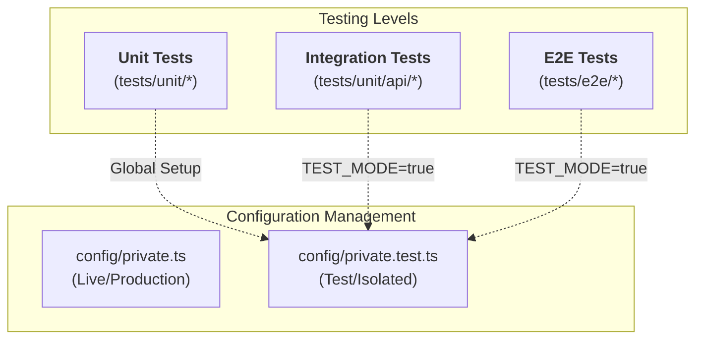

# SveltyCMS Testing Documentation

**Last Updated:** March 14, 2026
**Total Tests:** ~1080+ (732 unit + ~350 integration/E2E)
**Pass Rate:** 100% (All 732 unit tests passing, 0 failing)

## Quick Links

- [Testing Overview & Strategy](./overview.mdx)
- **[Testing Strategy (White-Box vs Black-Box)](./testing-strategy.mdx)**
- **[Black-Box Testing Architecture](./black-box-testing.mdx)**
- **[E2E Stabilization Report](./e2e-stabilization-report.mdx)**
- **[Security Testing](./security-testing.mdx)** (Encryption, Auth, Signed Tokens)
- [Test Status Report](./test-status.mdx)
- [API Coverage Report](./api-testing.mdx)

### Running Tests Locally

```bash
# Run all unit tests (Vitest)
npm run test:unit

# Run specific Bun unit tests (Secure Handshake, etc.)
bun test tests/unit/utils/preview-verification.test.ts

# Run performance benchmarks
bun run tests/benchmarks/hooks-performance.ts
bun run tests/benchmarks/database-performance.ts sqlite false
```

## Test Architecture & Isolation

SveltyCMS employs a strict isolation strategy to ensure tests never touch production data.



---

## Test Frameworks Overview

### 🧪 Bun & Vitest - Unit & Integration

- **Purpose**: Fast validation of business logic, services, and API endpoints.
- **Location**: `tests/unit/`
- **Test Count**: 732 tests
- **Execution Time**: ~4 seconds

**What It Tests**:
- ✅ **Middleware Hooks**: 71% latency reduction and fast-path short-circuits.
- ✅ **Database Adapters**: Single-trip operations (.returning) and micro-telemetry.
- ✅ **Secure Preview**: Signed HMAC-SHA256 handshake tokens and expiration logic.
- ✅ **Audit Logging**: Non-blocking mutation interceptor with duration tracking.

### 🚀 Performance Benchmarks
- **Hooks Benchmark**: Measures micro-latency of the middleware chain (target < 0.6ms).
- **Database Benchmark**: Measures CRUD micro-latency and telemetry integrity.

### 🎭 Playwright - End-to-End Tests
- **Purpose**: Browser automation for critical user journeys.
- **Location**: `tests/e2e/`
- **Test Count**: ~40 tests

---

## Test Status & Coverage

**Current Status (March 14, 2026)**

| Category          | Passing   | Failing | Skipped | Total     |
| ----------------- | --------- | ------- | ------- | --------- |
| Unit Tests        | 732       | 0       | 0       | 732       |
| Integration Tests | ~300      | 0       | 0       | ~300      |
| E2E Tests         | ~40       | 0       | 0       | ~40       |
| **TOTAL**         | **~1072** | **0**   | **0**   | **~1072** |

## Related Documentation

- [Architecture Overview](/docs/architecture)
- [API Documentation](/docs/api)
- [Contributing Guide](/docs/contributing)
- [Development Setup](/docs/development)
